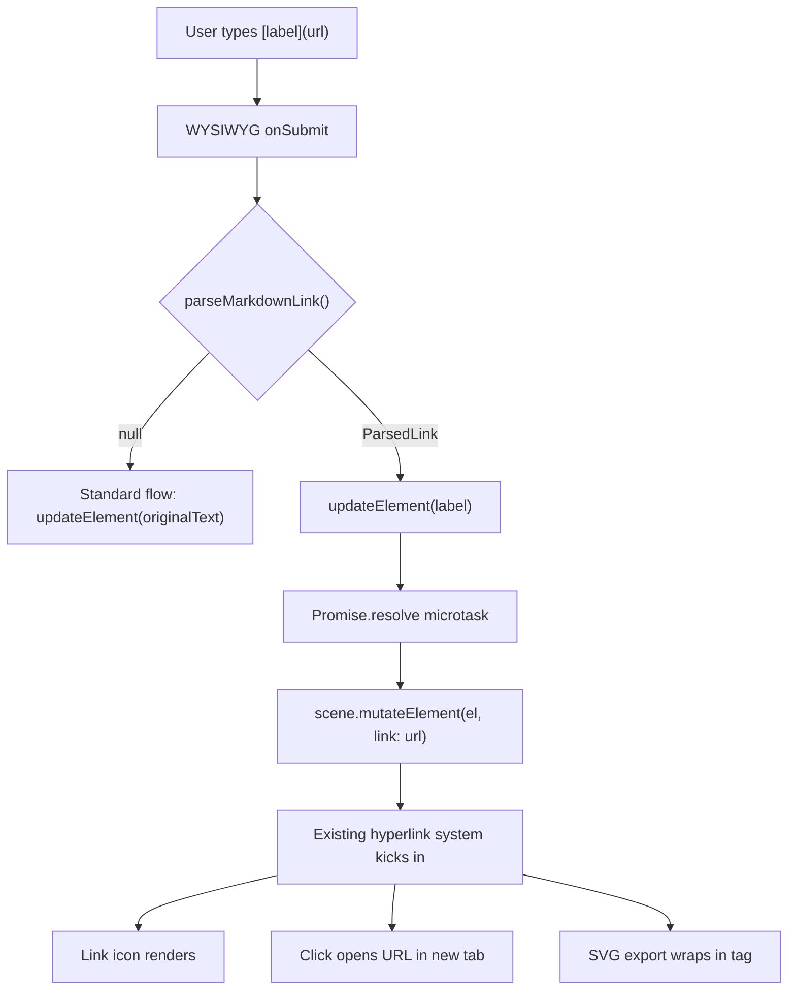

# Аналіз Issue #11024: Support HTML hyperlink creation in Excalidraw elements

## 1. Що саме потрібно змінити?

Issue просить додати підтримку markdown-style посилань у текстових елементах: коли користувач набирає `[label](url)` в текстовому елементі, Excalidraw повинен:

- Розпізнати цей формат як гіперпосилання
- Відобразити лише `label` як видимий текст елемента
- Прикріпити `url` до існуючого поля `element.link` (вже є в базовому типі `_ExcalidrawElementBase`)
- Посилання повинні бути клікабельними і відкриватися в новій вкладці
- Захист від шкідливих URL (`javascript:`, `data:`) через існуючий `@braintree/sanitize-url`

**Важливе обмеження**: тільки повний збіг тексту з патерном `[label](url)` обробляється. Часткові посилання типу `"See [here](url) for details"` залишаються як є -- повноцінний inline rendering вимагав би rich text engine.

## 2. Які файли будуть зачеплені?

На основі аналізу PR [#11049](https://github.com/excalidraw/excalidraw/pull/11049), що вже реалізує цей issue:

**Нові файли (2):**

- `packages/excalidraw/utils/markdownLink.ts` -- парсер markdown-посилань (regex `^\\[([^\\]]*)\\]\\(([^)]+)\\)$`, функція `parseMarkdownLink`)
- `packages/excalidraw/tests/markdownLink.test.ts` -- 12 unit тестів для парсера

**Модифіковані файли (2):**

- [packages/excalidraw/components/App.tsx](packages/excalidraw/components/App.tsx) -- інтеграція парсера в `onSubmit` callback WYSIWYG-редактора (рядок ~5724)
- [packages/excalidraw/locales/en.json](packages/excalidraw/locales/en.json) -- нова toast-стрічка `"markdownLinkDetected"`

**Файли, що НЕ змінюються (але важливі для розуміння):**

- [packages/element/src/types.ts](packages/element/src/types.ts) -- `element.link: string | null` вже існує на `_ExcalidrawElementBase`
- [packages/excalidraw/components/hyperlink/Hyperlink.tsx](packages/excalidraw/components/hyperlink/Hyperlink.tsx) -- існуюча система гіперпосилань (іконка, tooltip, Ctrl+K) перевикористовується as-is
- [packages/common/src/url.ts](packages/common/src/url.ts) -- `normalizeLink` + `sanitize-url` вже реалізовані
- [packages/excalidraw/renderer/staticScene.ts](packages/excalidraw/renderer/staticScene.ts) -- рендеринг іконки посилання вже працює
- [packages/excalidraw/renderer/staticSvgScene.ts](packages/excalidraw/renderer/staticSvgScene.ts) -- SVG export з `<a href>` вже працює

## 3. Складність: **Low**

Обгрунтування:

- Зміни торкаються лише **4 файлів** (+225 / -2 рядки)
- Основна логіка -- один regex + одна функція-парсер (~30 рядків реальної логіки)
- Повністю перевикористовує існуючу інфраструктуру гіперпосилань
- Не потребує змін у типах, рендерингу, серіалізації чи collab-протоколі
- Точка інтеграції -- єдиний `onSubmit` callback в `App.tsx`

## 4. Blast radius

**Мінімальний:**

- Зачіплений flow: тільки момент завершення редагування тексту (submit WYSIWYG)
- Існуючий код не модифікується destructively -- додається нова гілка перед `updateElement`
- Якщо `parseMarkdownLink` повертає `null` (більшість випадків), поведінка ідентична поточній
- Ризики:
  - `Promise.resolve().then(...)` для встановлення `link` -- мікротаск може створити проблеми з undo/redo ordering
  - Bound text elements (текст прив'язаний до фігури) -- потребує перевірки, чи коректно працює `redrawTextBoundingBox` після заміни тексту на label
  - Collab: `mutateElement` в мікротасці може генерувати окремий sync delta

## 5. Пов'язані issues та PRs

- **PR [#11049](https://github.com/excalidraw/excalidraw/pull/11049)**: "feat: auto-detect markdown links in text elements" by @amirai0396 -- **вже реалізує цей issue**. Статус: open, mergeable: unstable. 1 commit, 4 files changed.
- Інших пов'язаних issues/PRs на сторінці issue не згадано.

## 6. План реалізації

Оскільки PR #11049 вже існує, є два шляхи:

### Шлях A: Підхід з PR #11049 (мінімальний, "Option A")

Реалізація з PR робить рівно те, що потрібно для мінімального MVP:

1. **Створити парсер** `packages/excalidraw/utils/markdownLink.ts`:
  - Regex `^\\[([^\\]]*)\\]\\(([^)]+)\\)$` для повного збігу
  - `parseMarkdownLink(text)` повертає `{ label, url }` або `null`
  - Використовує `normalizeLink` з `@excalidraw/common` для sanitization
  - Блокує `about:blank` (результат sanitize-url для `javascript:` / `data:`)
2. **Інтегрувати в WYSIWYG submit** в `App.tsx` (~рядок 5724):
  - У `onSubmit` перед `updateElement` викликати `parseMarkdownLink(nextOriginalText)`
  - Якщо збіг: замінити текст на label, встановити `element.link` через `mutateElement`
3. **Додати i18n** -- toast повідомлення в `en.json`
4. **Написати тести** -- unit тести для парсера (valid links, partial matches, malicious URLs)

### Шлях B: Покращений підхід (рекомендований, якщо робити самостійно)

Доповнення до PR #11049:

- **Уникнути Promise.resolve microtask** -- встановлювати `link` синхронно через `updateElement` або розширити його параметри, щоб передати `link` разом із текстом
- **Зберегти originalText** -- записувати повний markdown `[label](url)` в `originalText`, а `label` тільки в `text`, щоб при повторному редагуванні користувач бачив оригінальний формат
- **Toast notification** -- показувати користувачу, що link було автоматично визначено
- **Bound text** -- протестувати сценарій з текстом, прив'язаним до rectangle/ellipse
- **Undo/redo** -- переконатись, що одна дія undo відкатує і текст, і link

### Невирішені питання (не в scope issue, але варто мати на увазі)

- Повторне редагування: коли користувач double-clicks на елемент з label, він побачить тільки label, а не оригінальний `[label](url)`. Потрібен UX для відновлення зв'язку.
- Часткові inline посилання (Option B в PR) -- потребують rich text engine, оцінка ~600-900 рядків, 3-5 днів роботи.

