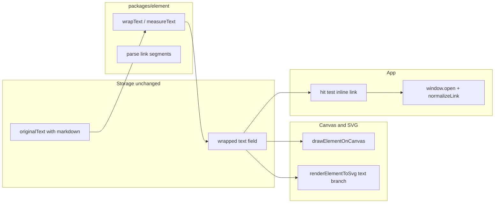

# План: Markdown hyperlinks у text elements (#11024)

## Уточнення щодо шляхів у специфікації

Фактичні модулі: `[packages/element/src/textElement.ts](packages/element/src/textElement.ts)` (layout через `wrapText` / `measureText`), `[packages/element/src/renderElement.ts](packages/element/src/renderElement.ts)` (`drawElementOnCanvas` — зараз один `fillText` на рядок). Експорт SVG: `[packages/excalidraw/renderer/staticSvgScene.ts](packages/excalidraw/renderer/staticSvgScene.ts)` (аналогічний цикл по `lines` і `<text>`). Додатково: `[packages/excalidraw/components/App.tsx](packages/excalidraw/components/App.tsx)` — курсор, pointer down/up, відкриття посилання (поруч із `getElementLinkAtPosition` / `handleElementLinkClick`).

## 1. Парсинг і модель сегментів

- Додати невеликий модуль у `packages/element/src/` (наприклад `textMarkdownLink.ts`) з:
  - Розбиттям рядка на чергуються **plain** і **link** (`label`, `url`, `raw` для збереження джерела в `element.text`).
  - Обмежена граматика v1: regex на кшталт `\[[^\]]+\]\([^)]+\)` (без вкладених дужок у URL — прийнятно для першої версії; `]` у label — не підтримувати або документувати як обмеження).
- Експортувати чисті функції для wrap, render і hit-test (зручно покрити тестами).

## 2. Wrap і measure (критично для AC)

Зараз `[getLineWidth](packages/element/src/textMeasurements.ts)` і `[wrapLine` / `parseTokens](packages/element/src/textWrapping.ts)` вважають ширину всього рядка включно з `[label](url)`, тоді як на полотні має бути лише `label` — інакше box і переноси будуть хибними.

- Розширити pipeline: для «hard line» спочатку виділити markdown-лінки як **атомарні одиниці** (як один токен): ширина одиниці = `getLineWidth(label, font)`, у рядок виводу потрапляє **оригінальний** `raw`.
- Plain-фрагменти між лінками залишаються на існуючій логіці `parseTokens` + поточний wrap.
- Точка інтеграції: `[wrapText` / `getWrappedTextLines](packages/element/src/textWrapping.ts)` або обгортка, яку викликає `[redrawTextBoundingBox](packages/element/src/textElement.ts)` лише якщо в тексті є ознаки `[...](...)` (оптимізація).
- Якщо немає жодного валідного лінка — **повна поведінка без змін** (AC 4).

## 3. Canvas-рендер

У `[drawElementOnCanvas](packages/element/src/renderElement.ts)` гілка `isTextElement`:

- Для кожного рядка з `element.text`: розбити на сегменти, для plain — `fillText` з поточним `fillStyle`; для link — колір посилання (наприклад узгоджений з існуючим синім гіперпосилань, з урахуванням dark mode через `applyDarkModeFilter` як для звичайного тексту), потім `fillText(label, ...)`, потім підкреслення (`strokeRect` / лінія під базовою лінією з урахуванням `verticalOffset` і `fontSize`) (AC 3).
- RTL-гілка (`dir`, тимчасове підключення canvas) має залишитись коректною: малювання сегментів послідовно з тим самим порядком обчислення X, що й для hit-test.

## 4. SVG-експорт

У `[staticSvgScene.ts](packages/excalidraw/renderer/staticSvgScene.ts)` у гілці text: замість одного `<text>` на рядок — група `<tspan>` або кілька `<text>` з однаковими `x/y` offset; для лінків — `<a href="..." target="_blank" rel="noopener noreferrer">` + стиль підкреслення/кольору. Застосувати `[normalizeLink](packages/common/src/url.ts)` до `href` (як для `element.link`).

## 5. Hit-test і взаємодія в App

- Додати в `packages/element` функцію на кшталт `getMarkdownLinkAtPointInTextElement(element, point, elementsMap, appState)`:
  - Перетворити глобальну точку в локальні координати тексту (обернення на `-angle`, зсув як у рендері: `horizontalOffset`, `lineHeightPx`, `verticalOffset`, `textAlign`).
  - Пройти ті самі сегменти/рядки, що й canvas; для кожного link-сегмента перевірити прямокутник навколо `label` (невеликий threshold у залежності від zoom, за аналогією з `[isPointHittingLinkIcon](packages/excalidraw/components/hyperlink/helpers.ts)`).
  - Повернути санітизований URL через `normalizeLink`; якщо порожній/небезпечний — не вважати клікабельним.
- У `[App.tsx](packages/excalidraw/components/App.tsx)`:
  - Поруч із `getElementLinkAtPosition` / `handleCanvasPointerMove`: якщо під курсором text element (не в режимі редагування цього ж елемента), перевірити inline link; виставляти `CURSOR_TYPE.POINTER` і зберігати URL для pointer up (окремі поля класу, **не** підміняти `element.link`).
  - У `handleElementLinkClick` (або поруч): якщо збережений inline URL і той самий hit на pointer up — відкрити через ту ж схему, що й для `element.link` (`normalizeLink`, `onLinkOpen`, `window.open` з `opener = null`, `target` `_blank` / `_self` через `[isLocalLink](packages/common/src/url.ts)`).
- **Не змінювати** поведінку `element.link`, `isPointHittingLink`, іконку лінка на фігурах (AC non-goals).

## 6. Тести і збірка

- Юніт-тести в `[packages/element/tests/](packages/element/tests/)` для: парсингу, wrap (перенос не рве `[...](...)` посередині, ширина рядка з лінком = ширина label), опційно hit-test на синтетичних координатах.
- Прогін `[yarn test](https://github.com/)` і `[yarn build](https://github.com/)` згідно AC 5–6; оновити снапшоти лише якщо експорт/рендер змінить очікуваний вивід.

## Ризики та обмеження

- Складні URL з `)` у шляху — без escape не парсяться; прийнятно для v1.
- Синхронізація wrap між textarea (показує сирий markdown) і canvas — лише якщо wrap у полі збігається з алгоритмом у `packages/element`; існуюча архітектура вже покладається на `wrapText` для `element.text` — тому критично зберегти один source of truth для wrap.

