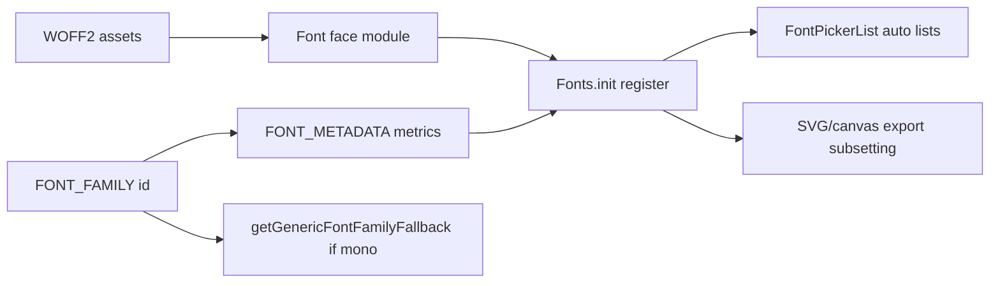

# Plan: Extended fonts (spec 10834)

## Scope

- **In scope:** Phase 1 from the spec — bundle new font(s) the same way as existing canvas fonts (e.g. Nunito), including export embedding and tests.
- **Out of scope (later milestones):** Dynamic font catalog, integrator-only registration API, and picker **categories** (Phase 2) unless you explicitly add them in a follow-up PR.

**Prerequisite (product/legal):** Pick concrete font(s) (prefer [SIL OFL](https://openfontlicense.org/) or equivalent), confirm redistribution and embedding in PNG/SVG/PDF, and add attribution where the project documents third-party assets (e.g. package README or existing license section — there is no root `NOTICE` file today).

## Implementation flow

## Code changes (per new family)

1. **Numeric ID and name** — Add a new entry to `[packages/common/src/constants.ts](packages/common/src/constants.ts)` in `FONT_FAMILY` (next free integer is **11** after `Assistant: 10`). Key string must match the CSS `font-family` name used in `FontFace`.
2. **Fallback behavior** — In `[getGenericFontFamilyFallback](packages/common/src/constants.ts)`, add a `case` for the new id only if it should use `MONOSPACE_GENERIC_FONT` (like Cascadia / Comic Shanns). Otherwise sans-serif default applies.
3. **Metrics** — Add an entry to `[packages/common/src/font-metadata.ts](packages/common/src/font-metadata.ts)` for the new `FONT_FAMILY` value (`unitsPerEm`, `ascender`, `descender`, `lineHeight`). Prefer values from the font’s OS/2 and hhea tables (or match a close existing font only as a temporary fallback — wrong metrics distort layout).
4. **WOFF2 + face descriptors** — New folder under `[packages/excalidraw/fonts/<FamilyName>/](packages/excalidraw/fonts/)` with `.woff2` files and an `index.ts` exporting `ExcalidrawFontFaceDescriptor[]`, following `[packages/excalidraw/fonts/Nunito/index.ts](packages/excalidraw/fonts/Nunito/index.ts)`: import each file, use `[GOOGLE_FONTS_RANGES](packages/common/src/font-metadata.ts)` when using Google Fonts–style unicode splits, set `weight`/`unicodeRange` to match subsets.
5. **Registration** — In `[packages/excalidraw/fonts/Fonts.ts](packages/excalidraw/fonts/Fonts.ts)`: import the new face array and call `init("<Key>", ...Faces)` in `Fonts.init()` alongside existing families.
6. **Picker presentation** — Update `[packages/excalidraw/components/FontPicker/FontPickerList.tsx](packages/excalidraw/components/FontPicker/FontPickerList.tsx)` `getFontFamilyIcon` (and any label-only tweaks) if the new font should not use the default icon. The scrollable list is built from `Fonts.registered`, so **no list wiring is required** once registration and `private`/`fallback` flags are correct.
7. **Optional quick-picks** — Only if product wants a fourth default button: extend `[DEFAULT_FONTS](packages/excalidraw/components/FontPicker/FontPicker.tsx)` and i18n keys under `[packages/excalidraw/locales/en.json](packages/excalidraw/locales/en.json)` (and other locales if the project requires parity).
8. **Licensing / docs** — Record the font name, license, and source in the appropriate place used by this repo for third-party fonts (check existing font mentions in package or top-level README). Update `[docs/specs/10834.md](docs/specs/10834.md)` status line to “Implemented (Phase 1)” when done, if you want the spec to track delivery.

Build tooling: `.woff2` imports are handled by existing esbuild/vite plugins (`[scripts/woff2/woff2-esbuild-plugins.js](scripts/woff2/woff2-esbuild-plugins.js)`); no plugin change expected for local files under `packages/excalidraw/fonts/`.

## Tests (required)

| Area                                   | File / approach                                                                                                                                                                                                                                                                                                                                        |
| -------------------------------------- | ------------------------------------------------------------------------------------------------------------------------------------------------------------------------------------------------------------------------------------------------------------------------------------------------------------------------------------------------------ |
| **SVG export + font embedding**        | Extend `[packages/excalidraw/tests/scene/export.test.ts](packages/excalidraw/tests/scene/export.test.ts)`: add a text element using the **new** `FONT_FAMILY` id (mirror the existing Nunito fixture at ~line 48). Run snapshot update so the subset `@font-face` output is covered.                                                                   |
| **JSON restore**                       | Add or extend a case in `[packages/excalidraw/tests/data/restore.test.ts](packages/excalidraw/tests/data/restore.test.ts)` with `fontFamily` set to the new id to assert round-trip / migration behavior matches other families.                                                                                                                       |
| **Line height / metrics**              | If the new font has a non-default `lineHeight` in metadata, add an expectation in `[packages/element/tests/textElement.test.ts](packages/element/tests/textElement.test.ts)` (same pattern as `getLineHeight(FONT_FAMILY.Cascadia)`).                                                                                                                  |
| **Font picker**                        | Extend `[packages/excalidraw/components/FontPicker/FontPicker.test.tsx](packages/excalidraw/components/FontPicker/FontPicker.test.tsx)`: after opening the picker, assert the new family **label** appears (query by accessible name / text from `FONT_FAMILY` key) or add a stable `data-testid` on list rows if the team prefers explicit selectors. |
| **Regression (optional but valuable)** | If default tool styles or shortcuts touch font family, align `[packages/excalidraw/tests/regressionTests.test.tsx](packages/excalidraw/tests/regressionTests.test.tsx)` only if behavior changes.                                                                                                                                                      |

**Commands:** `yarn test:typecheck` and `yarn test:update` (per [CLAUDE.md](CLAUDE.md)) before commit; review snapshot diffs for `export.test.ts` for unexpected churn.

## Later phases (spec only — not this PR unless scoped)

- **Phase 2:** Categories / richer previews in `FontPickerList`, still static registry.
- **Phase 3:** Dynamic catalog + stable non-integer font IDs (`[constants.ts` TODO](packages/common/src/constants.ts) / `[Fonts.ts` TODO](packages/excalidraw/fonts/Fonts.ts)) and embedder API.

