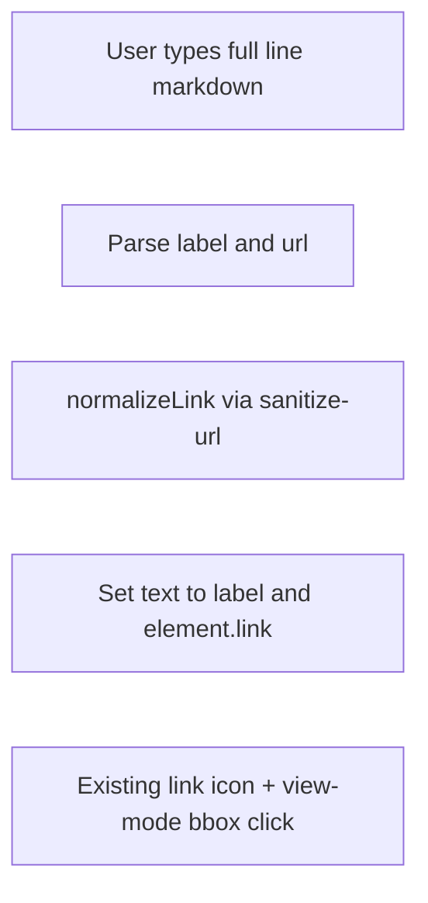

# Аналіз [excalidraw/excalidraw#11024](https://github.com/excalidraw/excalidraw/issues/11024)

## 1. Що саме потрібно змінити?

**Формулювання з issue:**

- Підтримка вводу у форматі `[label](hyperlink)` (як у markdown).
- Відображення розпізнаних посилань як **клікабельних** на canvas.
- Відкриття в **новій вкладці**.
- **Візуально помітні** посилання (наприклад підкреслення, колір).
- **Захист** від зламаних або шкідливих URL.

**Що вже є в кодовій базі (цей worktree):**

- Поле `**element.link`** на елементі + обгортка в SVG експорті (`[packages/excalidraw/renderer/staticSvgScene.ts](packages/excalidraw/renderer/staticSvgScene.ts)` — `<a href={normalizeLink(...)}>`).
- Санітизація через `**normalizeLink`** → `@braintree/sanitize-url` (`[packages/common/src/url.ts](packages/common/src/url.ts)`).
- Клік по посиланню: у view mode — по bounding box елемента з `link`; інакше — переважно по **іконці посилання**; відкриття з `target` `_blank` для зовнішніх URL (`[packages/excalidraw/components/App.tsx](packages/excalidraw/components/App.tsx)` ~6642–6666, `[packages/excalidraw/components/hyperlink/helpers.ts](packages/excalidraw/components/hyperlink/helpers.ts)`).
- Рендер тексту на canvas — **plain `fillText` по рядках**, без окремих стилів для «частини» тексту (`[packages/element/src/renderElement.ts](packages/element/src/renderElement.ts)` ~546–591).

**Розрив між issue і поточною архітектурою:**

- Один елемент тексту = один рядок `text` + опційно **один** `link` на весь елемент, а не **inline** кілька посилань у середині рядка.
- «Підкреслення / колір посилання» на canvas **не реалізовані** — інтерактивність для редактора візуально показується **іконкою** (`[packages/excalidraw/renderer/staticScene.ts](packages/excalidraw/renderer/staticScene.ts)` — `renderLinkIcon`).

**Пов’язаний PR [#11049](https://github.com/excalidraw/excalidraw/pull/11049)** (згаданий у timeline issue):

- Якщо **весь** вміст текстового елемента — рівно `[label](url)`, після завершення редагування: показувати **лише label** у `text`, URL записати в `**element.link`**.
- Рядки на кшталт `See [here](url) for details` **свідомо не змінюються**.
- Безпека: ті самі обмеження через `sanitize-url`, що й у гіперпосиланнях.

Тобто PR закриває **частину** бажаної поведінки (ввід markdown → існуючий hyperlink), але **не** inline-посилання в одному рядку і **не** окремий стиль підкреслення для фрагмента тексту на canvas.

---

## 2. Які файли будуть зачеплені?

**Мінімальний шлях (як у PR #11049 — інтеграція з `element.link`):**

- Точка завершення редагування тексту: ймовірно `[packages/excalidraw/wysiwyg/textWysiwyg.tsx](packages/excalidraw/wysiwyg/textWysiwyg.tsx)` і/або місця, де фіксується `text` + оновлюється елемент.
- Опційно невеликий модуль парсингу (наприклад `markdownLink.ts` у `packages/excalidraw` або `packages/common`).
- Тести: на кшталт `packages/excalidraw/tests/markdownLink.test.ts` (у PR зазначено 12 тестів).
- Можливі дотики до `[packages/excalidraw/data/restore.ts](packages/excalidraw/data/restore.ts)` лише якщо потрібна нормалізація при відновленні (уже є `normalizeLink` для `element.link`).

**Повна відповідь issue (inline markdown + стилізація на canvas):**

- `[packages/element/src/renderElement.ts](packages/element/src/renderElement.ts)` — замість одного `fillText` на рядок: сегменти з різним `fillStyle` + підкреслення; складніше з RTL/вирівнюванням.
- Можливо розширення моделі `ExcalidrawTextElement` (типи в `[packages/element](packages/element)`) — зберігання spans або окремого формату.
- `[packages/excalidraw/renderer/staticSvgScene.ts](packages/excalidraw/renderer/staticSvgScene.ts)` — кілька `<tspan>` / вкладених `<a>`.
- `[packages/excalidraw/components/App.tsx](packages/excalidraw/components/App.tsx)` + `[hyperlink/helpers.ts](packages/excalidraw/components/hyperlink/helpers.ts)` — hit-test по підпрямокутниках для кожного inline-посилання.
- Експорт / серіалізація — узгодження з форматом `.excalidraw`.

---

## 3. Складність (Low / Medium / High)

| Підхід                                                                               | Оцінка                                                               |
| ------------------------------------------------------------------------------------ | -------------------------------------------------------------------- |
| PR #11049: «весь текст = один markdown link» → `text` + `element.link`               | **Medium** (парсинг, крайові випадки, undo, тести; без зміни моделі) |
| Повна специфікація issue: **кілька** inline-посилань + стилі на canvas + hit-testing | **High** (модель даних, layout, усі шляхи рендеру та експорту)       |

---

## 4. Blast radius

- **Підхід PR #11049:** обмежений текстовими елементами та шляхом commit тексту; повторно використовує `normalizeLink` і існуючий UI гіперпосилання. Ризик регресій у **редагуванні тексту та історії**, але не в геометрії інших інструментів.
- **Inline + стилізація:** **високий** — тип елемента тексту, кеш canvas, колаборація, SVG/PNG експорт, пошук по тексту, accessibility.

---

## 5. Пов’язані issues / PRs

- **[PR #11049](https://github.com/excalidraw/excalidraw/pull/11049)** — `feat: auto-detect markdown links in text elements`, заявлено **Closes #11024**, 4 файли, +225 / −2 (станом на опис PR).
- Інших явних посилань у змісті issue немає; додаткові обговорення — у коментарях PR/issue на GitHub.

---

## 6. План реалізації (практичний)

1. **Узгодити scope з issue:** прийняти PR #11049 як **MVP** (тільки «чистий» markdown на весь елемент) **або** явно розширити на inline — це інший обсяг робіт.
2. **Реалізувати парсер** строгого вигляду `^\[([^\]]+)\]\(([^)]+)\)$` (або еквівалент), з валідацією URL через `normalizeLink`; відхиляти / не змінювати текст, якщо паттерн не збігається повністю (як у PR).
3. **Викликати нормалізацію** при збереженні тексту з WYSIWYG; оновити `text` і `link` атомарно (для коректного undo).
4. **Тести:** валідні/невалідні рядки, `javascript:` / `data:` (очікується блокування), undo/redo, опційно колаборація.
5. **Якщо потрібні підкреслення саме в тексті:** окремий етап — розбиття рядка на сегменти в `renderElement.ts` + оновлення моделі; не змішувати з кроком 1 без дизайн-рішення.

**Примітка:** у цьому worktree **немає** файлів на кшталт `markdownLink.test.ts` — гілка відповідає стану до злиття PR #11049; план імплементації для локальної копії збігається з описом PR, якщо брати їхній підхід.