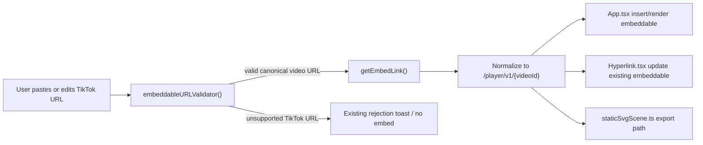

---
stepsCompleted:
  - step-01-init
  - step-02-context
  - step-03-starter
  - step-04-decisions
  - step-05-patterns
  - step-06-structure
  - step-07-validation
  - step-08-complete
inputDocuments:
  - local: _bmad-output/planning-artifacts/prd.md
  - issue: https://github.com/excalidraw/excalidraw/issues/10819
  - local: packages/element/src/embeddable.ts
  - local: packages/element/tests/embeddable.test.ts
  - local: packages/excalidraw/components/App.tsx
  - local: packages/excalidraw/components/hyperlink/Hyperlink.tsx
  - local: packages/excalidraw/renderer/staticSvgScene.ts
  - external: https://developers.tiktok.com/doc/embed-player
workflowType: 'architecture'
project_name: '2026-fwdays-agentic-large-day03-hw'
user_name: 'VK'
date: '2026-04-04'
---

# Architecture Decision Document

## Overview

This change adds TikTok as a first-class embeddable provider in Excalidraw's shared embeddable pipeline. The implementation should accept canonical public TikTok video URLs, normalize them into TikTok's official player URL format, and render them through the existing embeddable element flow without introducing app-specific logic or new infrastructure.

The architecture impact is localized but not trivial. The current default validator is domain-based. A naive "add `tiktok.com` to the whitelist" change would accept unsupported TikTok URLs such as profile or non-video pages and would not guarantee a renderable iframe target. To satisfy the PRD, TikTok must be modeled as a provider with provider-specific parsing and normalization.

## Context

### PRD Drivers

- Users must be able to paste a public TikTok video URL and get a working embed.
- Default library consumers must receive the feature without custom configuration.
- Unsupported TikTok URLs must remain rejected in MVP.
- The implementation must avoid backend work, runtime dependencies, and network calls.

### Existing Embeddable Architecture

The current embeddable stack is centered in `packages/element/src/embeddable.ts` and reused by all major editor entry points:

- `embeddableURLValidator()` determines whether a URL is accepted by default.
- `getEmbedLink()` converts accepted URLs into renderable iframe or srcdoc metadata.
- `App.tsx` uses these functions for validation caching, paste flows, element insertion, and runtime rendering.
- `Hyperlink.tsx` uses the same functions when users edit embeddable links.
- `staticSvgScene.ts` uses `getEmbedLink()` when exporting embeddables.

This architecture is intentionally centralized. Provider additions should stay in the shared `@excalidraw/element` layer so all consumers inherit the behavior automatically.

## External Provider Constraint

TikTok's official embed documentation defines the player URL shape as `https://www.tiktok.com/player/v1/{postId}` and derives `{postId}` from a canonical TikTok video page URL such as `https://www.tiktok.com/@user/video/{postId}`. This implies the canonical TikTok page URL is a user-facing source URL, while the player URL is the rendering target.

Inference from the provider docs: Excalidraw should not assume the canonical TikTok page URL itself is the correct iframe source. The architecture should extract the video ID and normalize to the player URL.

## Architectural Decisions

### AD1. Implement TikTok support in the shared provider layer

TikTok support will be implemented in `packages/element/src/embeddable.ts`, not in `excalidraw-app/` or UI-specific components.

Reasoning:

- The PRD explicitly targets default library behavior.
- `App.tsx`, hyperlink editing, paste detection, and export already share this module.
- A single shared provider implementation avoids divergence between app and package consumers.

### AD2. Add provider-specific TikTok parsing instead of domain-only allowlisting

Introduce a TikTok-specific parser for canonical video URLs matching:

- `https://www.tiktok.com/@{creator}/video/{videoId}`
- `https://tiktok.com/@{creator}/video/{videoId}`

The parser should extract `videoId` and reject unsupported TikTok URL shapes.

Reasoning:

- The current default validator only checks hostname membership.
- Adding `tiktok.com` directly to the generic allowlist would validate any TikTok page, including unsupported non-video pages.
- PRD FR6 requires rejecting unsupported TikTok inputs in MVP.

Decision:

- TikTok validation will be handled through an explicit provider-specific branch in `embeddableURLValidator()`.
- TikTok should not rely solely on the generic `ALLOWED_DOMAINS` fallback for acceptance semantics.

### AD3. Normalize accepted TikTok URLs to the official embed player URL

For accepted TikTok video URLs, `getEmbedLink()` will return an iframe target in the form:

- `https://www.tiktok.com/player/v1/{videoId}`

The returned embed metadata should be marked as a renderable media embed rather than a srcdoc document embed.

Reasoning:

- TikTok documents a dedicated player URL for iframe embedding.
- Excalidraw already normalizes several providers from share URLs to embed URLs.
- This keeps user-facing input URLs separate from provider rendering URLs.

### AD4. Model TikTok as a video provider with portrait-first default sizing

TikTok embeds should be returned as `type: "video"` with portrait-biased intrinsic dimensions.

Reasoning:

- TikTok content is primarily vertical video.
- `insertEmbeddableElement()` sizes new elements from `embedLink.intrinsicSize`, so provider defaults directly shape the initial user experience.
- Treating TikTok as a video provider aligns it with YouTube, Vimeo, and Google Drive video behavior.

Recommended initial dimensions:

- Reuse an existing portrait-friendly ratio close to `315x560` unless manual verification shows TikTok player chrome needs a different size.

### AD5. Do not expand sandbox privileges unless manual verification proves it is necessary

Do not add TikTok to `ALLOW_SAME_ORIGIN` in the first implementation pass unless manual verification shows the official player requires it.

Reasoning:

- `ALLOW_SAME_ORIGIN` relaxes iframe sandbox restrictions.
- The PRD does not require same-origin privileges as a design goal.
- Minimal privilege is the safer default for a new provider.

## Affected Components

### Primary change surface

- `packages/element/src/embeddable.ts`
  - Add TikTok URL parser/regex.
  - Add TikTok validation branch.
  - Add TikTok URL normalization in `getEmbedLink()`.
  - Optionally add provider-specific intrinsic size constants.

### Test surface

- `packages/element/tests/embeddable.test.ts`
  - Add tests for accepted canonical TikTok URLs.
  - Add tests for rejected malformed or unsupported TikTok URLs.
  - Add tests for normalization to `www.tiktok.com/player/v1/{videoId}`.
  - Add tests covering `tiktok.com` and `www.tiktok.com` canonical variants.

### Indirectly impacted consumers

- `packages/excalidraw/components/App.tsx`
  - Validation cache path uses `embeddableURLValidator()`.
  - Runtime rendering path uses `getEmbedLink()`.
  - Paste flows and direct link-to-embed insertion use both functions.
  - Initial element size will reflect TikTok intrinsic dimensions.

- `packages/excalidraw/components/hyperlink/Hyperlink.tsx`
  - Editing an embeddable link will stop showing the whitelist rejection toast for supported TikTok video URLs.
  - Unsupported TikTok URLs should still show the existing rejection behavior.

- `packages/excalidraw/renderer/staticSvgScene.ts`
  - Export behavior depends on `getEmbedLink()` output.
  - A TikTok embed implemented as a player URL and non-document type should follow current non-srcdoc export behavior.

### Potential release/docs surface

- `packages/excalidraw/CHANGELOG.md`
  - Update if provider additions are documented in release notes.

## Component Interaction Flow

## Proposed File-Level Design

### `packages/element/src/embeddable.ts`

Add a TikTok canonical URL regex and parser function. The parser should:

- accept `tiktok.com` and `www.tiktok.com`,
- require the `/@user/video/{videoId}` path structure,
- extract a numeric or provider-valid video ID token,
- return `null` for non-video URLs.

Add TikTok handling in `getEmbedLink()` before the generic fallback. If parsing succeeds:

- compute `link = https://www.tiktok.com/player/v1/{videoId}`,
- return `type: "video"`,
- return portrait intrinsic dimensions,
- keep sandbox permissions minimal by default.

Add TikTok handling in `embeddableURLValidator()` before the generic `ALLOWED_DOMAINS` fallback. If the URL host is TikTok but parsing fails, return `false`.

This is the critical architectural adjustment that preserves FR6.

## Impact on Existing Architecture

### What changes

- The embeddable pipeline gains one provider-specific validation path in addition to the existing domain-based fallback.
- `getEmbedLink()` becomes responsible for another explicit source-to-player normalization rule.
- Initial embeddable sizing for one new provider is added to the provider catalog.

### What does not change

- No backend, API, persistence, schema, or collaboration protocol changes.
- No changes to public props such as `validateEmbeddable` or `renderEmbeddable`.
- No app-only customization layer is introduced.
- No change to existing providers unless a regression is introduced.

### Architectural impact assessment

- **Scope:** Low-to-moderate and localized.
- **Coupling impact:** Low. The change reinforces the existing shared-provider architecture.
- **Complexity impact:** Moderate. Validation is no longer purely hostname-based for all providers.
- **Risk profile:** Moderate, concentrated in URL parsing correctness and provider renderability.

The key architectural impact is conceptual rather than structural: the default validator moves one step toward provider-aware validation instead of relying exclusively on hostname membership.

## Risks and Mitigations

### Risk 1: Naive whitelist change accepts unsupported TikTok pages

Mitigation:

- Use provider-specific TikTok parsing in validation.
- Add explicit negative tests for non-video TikTok URLs.

### Risk 2: Official player requires sandbox permissions not currently granted

Mitigation:

- Start without `allowSameOrigin`.
- Perform manual verification against a public TikTok video.
- Add sandbox permissions only if proven necessary.

### Risk 3: Initial embed size feels wrong for portrait media

Mitigation:

- Use portrait defaults from day one.
- Validate insertion UX manually in canvas.

### Risk 4: Export behavior diverges from editor rendering

Mitigation:

- Verify `renderEmbeddables` export behavior with a TikTok embeddable.
- Keep TikTok implementation on the same non-srcdoc path as other player/video providers.

## Testing Strategy

### Automated

- Unit tests in `packages/element/tests/embeddable.test.ts` for:
  - canonical TikTok URL acceptance,
  - `www` and bare host variants,
  - malformed/non-video TikTok URL rejection,
  - normalization to the TikTok player URL,
  - intrinsic size expectations if codified.

### Manual

- Paste a public TikTok video URL into the canvas.
- Add/edit a TikTok URL through the embeddable link UI.
- Confirm no whitelist rejection toast for supported URLs.
- Confirm unsupported TikTok URLs still reject.
- Confirm rendering works in editor and behaves acceptably in export scenarios.

## Alternatives Considered

### Alternative A: Add `tiktok.com` to `ALLOWED_DOMAINS` only

Rejected.

This is the smallest code diff but does not satisfy the PRD reliably. It accepts all TikTok pages by hostname and does not guarantee a correct iframe target.

### Alternative B: Create a generalized provider registry refactor

Deferred.

This could unify validation and normalization across all providers, but it is too large for the feature scope. The current architecture supports an incremental provider-specific addition without broad refactoring.

## Implementation Guidance

Recommended implementation order:

1. Add TikTok parser and normalization in `packages/element/src/embeddable.ts`.
2. Add provider-specific validation logic in `embeddableURLValidator()`.
3. Add automated tests in `packages/element/tests/embeddable.test.ts`.
4. Manually verify paste, hyperlink edit, render, and export behavior.
5. Update changelog only if project release practice expects provider additions to be called out.

## Final Assessment

This feature does not require architectural restructuring. It fits the existing Excalidraw design where provider behavior is centralized in `@excalidraw/element` and consumed transitively by the editor and export layers.

The meaningful impact is on validation semantics. TikTok is the kind of provider where domain-level whitelisting is too blunt. The correct architectural response is a small provider-aware extension to the shared embeddable pipeline, not a broader system redesign.
