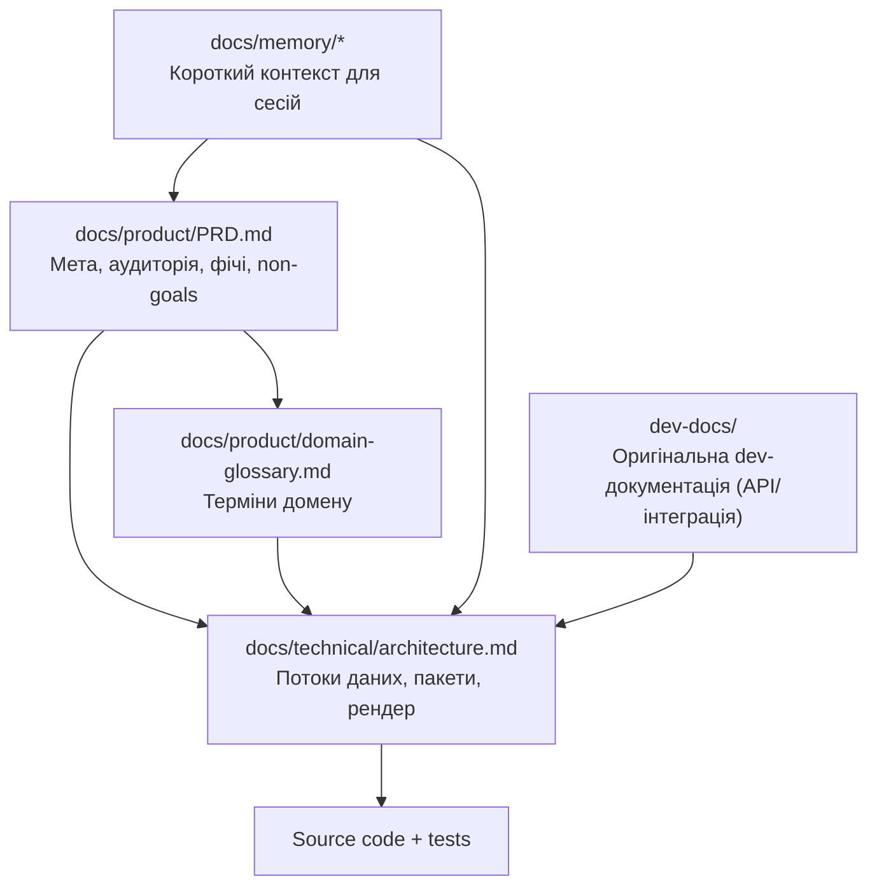

# Spec-Driven Development (SSD) — як працювати з цим репозиторієм

## Ідея

**SSD** тут означає: спочатку зафіксувати **що** і **навіщо** (продуктова специфікація та домен), потім **як устроєно** (архітектура), і лише тоді змінювати код і тести. Документи специфікації — **джерело істини для агентів і людей**; PR і рефакторинги повинні бути **зв’язані** з оновленням спеки, якщо змінюється поведінка або контракти.

## Шари документації

## Memory Bank vs SSD-спека

| Шар | Файли | Роль |
| --- | --- | --- |
| **Memory Bank** | Усі файли в `docs/memory/` (див. `projectbrief.md` — таблиця) | Стабільний контекст + **activeContext** / **progress** / **decisionLog** для поточної роботи; основні три файли залишаються «ядром» для коротких сесій |
| **Продуктова спека** | `docs/product/PRD.md`, `domain-glossary.md` | Вимоги і доменні значення термінів |
| **Технічна спека** | `docs/technical/architecture.md` | Структура системи, потоки, межі пакетів |

## `dev-docs/` і як з ним жити в SSD

У цьому репозиторії паралельно існує **`dev-docs/`** (Docusaurus) — детальна документація для інтеграторів та довідка по публічному API `@excalidraw/excalidraw`.

Правило, щоб уникнути “двох правд”:

- **`dev-docs/` — canonical** для “які є props/API, як інтегрувати пакет, нюанси SSR/Next.js”.
- **`docs/` — canonical** для “процес (SSD), продукт (PRD), архітектура цього monorepo, live-контекст (Memory Bank)”.

У `docs/` краще тримати **шпаргалки** й **посилання** на відповідні файли в `dev-docs/`, а не дублювати всю API-таблицю.

## Мінімальний workflow зміни

1. Уточнити в **PRD** або **глосарії**, якщо змінюється поведінка з точки зору користувача або термінологія.
2. Оновити **architecture.md**, якщо змінюються потоки даних, новий пакет або публічний API.
3. Оновити **Memory Bank** (`techContext` / `systemPatterns` / `projectbrief`), якщо змінились команди, патерни або мета; значні рішення — у **`decisionLog.md`**; поточну задачу — у **`activeContext.md`**.
4. Імплементація + тести (`yarn test:all` перед PR).

### Sync-checklist (щоб документація не відставала)

- Якщо змінили **публічний API** `@excalidraw/excalidraw` (props, `ExcalidrawAPI`, utils):
  - оновіть **`dev-docs/docs/@excalidraw/excalidraw/…`** (або додайте/виправте посилання)
  - перевірте, що `docs/integration/excalidraw.md` не вводить в оману (high-level)
- Якщо змінили **внутрішні потоки** (actions/render/state):
  - оновіть `docs/technical/architecture.md`
  - за потреби — “коротку версію” в `docs/memory/systemPatterns.md`
- Якщо змінили **процес/quality gates**:
  - оновіть цей файл (`docs/spec/SSD.md`) + `docs/memory/techContext.md` / `progress.md` за потреби

## Трасування (traceability)

- В PRD фічі формулюють **спостережувану поведінку**; у глосарії — **ідентифікатори з коду** (`AppState`, `ExcalidrawElement`, …).
- У `architecture.md` — **де в коді** реалізовано потік (файли/пакети).

## Коли оновлювати цей файл

При зміні **процесу** команди (наприклад, новий обов’язковий артефакт спеки, інший інструмент) — додати підрозділ тут, щоб агенти й нові учасники бачили актуальні правила.
